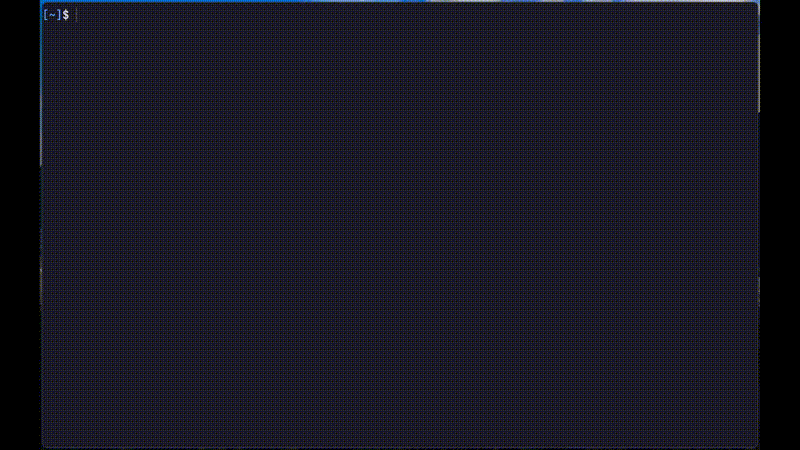

<div align="center">

# 🕹️ tgames

 




A terminal-based mini-games emulator.
</div>

## 🎮 List of games
- Snake
- Tetris
- 2048
- Minesweeper
- Flappy Bird

## 🛠️ Technical Highlights
`tgames` is built with scalability in mind. It uses a **Trait-based abstraction** to handle game logic, allowing for easy expansion.
* **State Machine Architecture:** Uses a centralized game loop and state machine to handle transitions between different game logics seamlessly.
* **High-Performance Rendering:** Leverages Ratatui for optimized terminal drawing and immediate-mode UI rendering, allowing for smooth, high-frequency updates with minimal CPU overhead
* **Non-Blocking Input:** Implemented a multi-threaded event loop using MPSC channels to decouple input polling from game logic, ensuring a fluid, non-blocking frame rate regardless of user activity.
* **Easy Extension:** Adding a new game is as simple as adding a variant to the `Games` enum and implementing the `GameManager` trait for a new struct. No changes to the core engine are required

## 🚀 Adding a New Game
The engine uses the Strategy Pattern to remain decoupled from game logic.
To add a new game, simply implement the GameManager trait and register it in the central dispatcher.

### Implement the Trait
```rust
impl GameManager for MyNewGame {
    fn process_events(&mut self) -> Result<()> { /* Handle non-blocking input */ }
    fn update(&mut self) -> Result<()>         { /* Physics & Logic */ }
    fn render(&mut self, terminal: &mut ...)   { /* Draw to TUI via Ratatui */ }
    fn reset(&mut self)                        { /* Re-initialize state */ }
    fn ended(&self) -> bool                    { /* Game Over condition */ }
    fn kill_execution(&self) -> bool           { /* Kill game execution condition */ }
}
```

### Register the game
Add the variant to the `Games` enum. The engine handles the lifecycle and state transitions automatically. New games are registered within the run_game dispatcher:
```Rust
fn run_game(&mut self) -> Result<()> {
    // more code...
    match game {
        Games::MyNewGame => self.game_instance[index]
            .get_or_insert_with(|| Box::new(MyNewGame::new()))
            .run(&mut self.terminal),
        // Other games logic...
        _ => { /* ... */ }
    }
    // more code...
}
```

## 📦 Installation
The installation can be done via cargo, just use:
````bash
cargo install tgames
``````

## 🦀 Why Rust?
I chose Rust for this project not just for its modern syntax, but for the specific guarantees it provides for systems-level development:

* **Fearless Concurrency:** Rust’s ownership model ensured that my multi-threaded input handling remained data-race free, allowing for a stable, non-blocking game loop.

* **Deterministic Resource Management:** Rust allows for precise control over heap allocations. This ensures that the game's "tick rate" remains constant, providing a smooth, predictable experience even as game state complexity grows.

* **Zero-Cost Abstractions:** The Trait-based architecture used in tgames allows for high-level modularity without sacrificing the performance of the underlying machine code.
